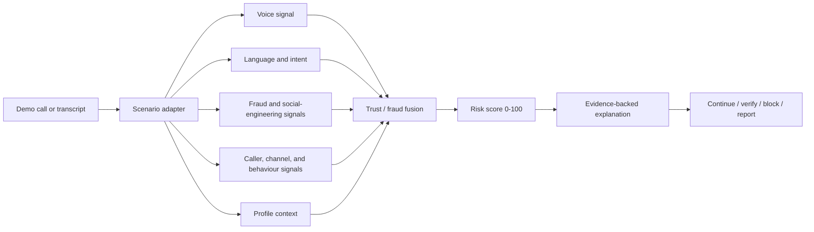

# Architecture

The demo keeps the pipeline modular at the API boundary. The scenario adapter currently provides deterministic synthetic signals. A production implementation can replace those adapters with STT, anti-spoofing, and LLM services without changing the dashboard contract.

The generated API client is derived from `lib/api-spec/openapi.yaml`. The Express implementation lives in `artifacts/api-server/src/routes/bhashashield.ts`; the React surface lives in `artifacts/bhashashield`.